<h1 align="center"> ДЗ 5 </h1>
<h1 align="center"> DML скрипты postgreSQL </h1>

---
1. ### Добавил запись с значением полей (TIMESTAMP '2011-06-20 15:36:38', 'sslErrorEnddate', 'node7.tn.corp', default) ###

```sql
--таблица
CREATE TABLE my_otus_project_schema.data_from_elasticsearch
(
date_error_appeared timestamp,
warning_type VARCHAR(50),
host VARCHAR(50),
date_inser_in_table timestamp DEFAULT CURRENT_TIMESTAMP
) TABLESPACE my_otus_project_tablespace;

--INSERT в таблицу
INSERT INTO data_from_elasticsearch
(date_error_appeared, warning_type, host, date_inser_in_table)
VALUES
(TIMESTAMP '2011-06-20 15:36:38', 'sslErrorEnddate', 'node7.tn.corp', default)
RETURNING date_error_appeared, warning_type, host, date_inser_in_table;
```

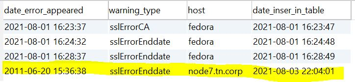

2. ### UPDATE FROM запись с значением полей (TIMESTAMP '2011-06-20 15:36:38', 'sslErrorEnddate', 'node7.tn.corp', default) из второй таблицы data_elasticsearch_description ###

```sql
--Вторая таблица
CREATE TABLE my_otus_project_schema.data_elasticsearch_description
(
warning_type VARCHAR(50),
host VARCHAR(50)
) TABLESPACE my_otus_project_tablespace;

--INSERT в таблицу
INSERT INTO data_elasticsearch_description
(warning_type, host)
VALUES
('sslErrorEnddate', 'node80.mydomain.com');

--UPDATE FROM из таблицы data_elasticsearch_description
UPDATE data_from_elasticsearch AS a
SET host = b.host
FROM data_elasticsearch_description AS b
WHERE a.warning_type = 'sslErrorEnddate'
AND a.date_error_appeared = TIMESTAMP '2011-06-20 15:36:38'
AND b.host = 'node80.mydomain.com';
```

| Содержимое таблицы data_elasticsearch_description |
| ------------------------------------------------- |
| 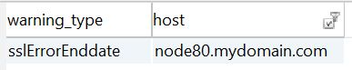                                   |

| Обновление записи |
| ----------------- |
| 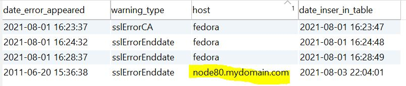  |

3. ### SELECT с регулярным выражением ###

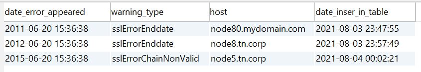
```sql
--Вывести строку содержащюю Chain
--1)
SELECT * FROM data_from_elasticsearch
WHERE warning_type LIKE '%Chain%';
--2)
SELECT * FROM data_from_elasticsearch
WHERE warning_type ~ '.*Chain';
```
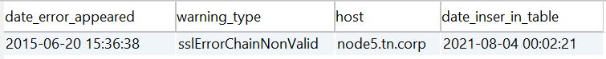

```sql
--Вывести все строки кроме тех которые содержат Chain
SELECT * FROM data_from_elasticsearch
WHERE warning_type !~ '.*Chain';
```
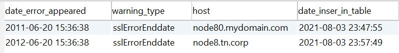

4. ### LEFT JOIN и INNER JOIN ###

```sql
SELECT *
FROM data_from_elasticsearch a
LEFT OUTER JOIN warning_type_description b
ON a.warning_type = b.warning_type;

SELECT *
FROM data_from_elasticsearch a
INNER JOIN warning_type_description b
ON a.warning_type = b.warning_type;
```

| Строки в таблице warning_type_description |
| ----------------------------------------- |
| 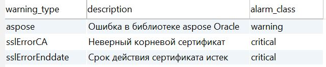         |


| LEFT OUTER JOIN (Возвращает все записи из левой таблицы + записи которые имеют соответствие из правой, там где справа нет соответствия поля помечаются null) |
| ------------------------------------------------------------------------------------------------------------------------------------------------------------ |
|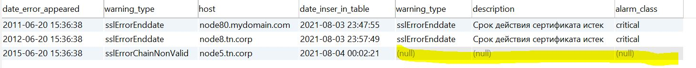                                                                                                                                        |


| INNER JOIN (остается только то, что есть в обеих таблицах) |
| ---------------------------------------------------------- |
| 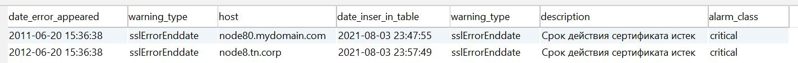                                         |

5. ### DELETE ###

| Таблица warning_type_description |
| -------------------------------- |
| |


| Таблица data_from_elasticsearch |
| --------------------------------|
| 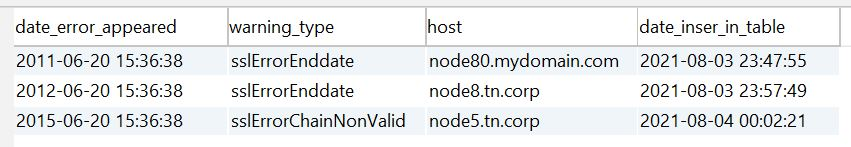|

```sql
DELETE FROM data_from_elasticsearch a
USING warning_type_description b
WHERE a.warning_type = b.warning_type
AND b.warning_type = 'sslErrorEnddate';
```
| Результат удаления в таблице data_from_elasticsearch строк, warning_type кторых равен 'sslErrorEnddate' из таблицы warning_type_description |
| ------------------------------------------------------------------------------------------------------------------------------------------- |
|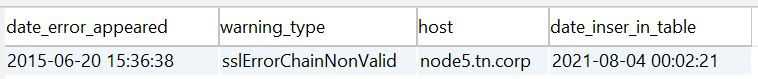                                                                                                                        |


6. ### COPY ###

```sql
--Создал таблицу
CREATE TABLE my_otus_project_schema.copy_test_table
(
id INT,
first_name VARCHAR(50),
last_name VARCHAR(50)
) TABLESPACE my_otus_project_tablespace;
```

Создал файл

cd /var/lib/postgresql

touch test.csv

cat test.csv

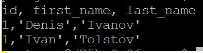

```sql
GRANT my_otus_project_user TO pg_read_server_files; --не сработало
ALTER USER my_otus_project_user superuser;

COPY my_otus_project_schema.copy_test_table
FROM '/var/lib/postgresql/test.csv'
DELIMITER ',' CSV HEADER;
```

| Результат наполнения таблицы с помощью COPY |
| ------------------------------------------- |
| 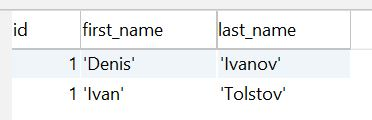                     |


| Database   | ver |
| -----      | --- |
| PostgreSQL | 13.3|
